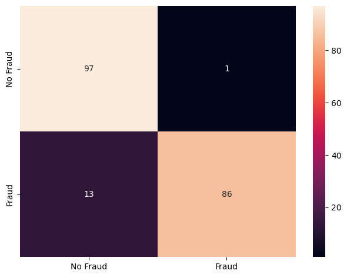

<!-- PROJECT SHIELDS -->
<!--
*** I'm using markdown "reference style" links for readability.
*** Reference links are enclosed in brackets [ ] instead of parentheses ( ).
*** See the bottom of this document for the declaration of the reference variables
*** for contributors-url, forks-url, etc. This is an optional, concise syntax you may use.
*** https://www.markdownguide.org/basic-syntax/#reference-style-links
-->
[![Contributors][contributors-shield]][contributors-url]
[![Forks][forks-shield]][forks-url]
[![Stargazers][stars-shield]][stars-url]
[![Issues][issues-shield]][issues-url]
[![MIT License][license-shield]][license-url]
[![LinkedIn][linkedin-shield]][linkedin-url]

<!-- PROJECT LOGO -->
 

  

<h3 align="center">Card payment fraud detector</h3>

  

    Logistic classification model for the detection of fraudulent credit card payments
     
    <a href="https://github.com/Javier-Requena/card-payment-fraud-detector-python"><strong>Explore the docs »</strong></a>
     
     
    <a href="https://github.com/Javier-Requena/card-payment-fraud-detector-python/issues">Report Bug</a>
    ·
    <a href="https://github.com/Javier-Requena/card-payment-fraud-detector-python/issues">Request Feature</a>
  

<!-- TABLE OF CONTENTS -->

  
Table of Contents

  <ol>
    <li>
      <a href="#about-the-project">About The Project</a>
      <ul>
        <li><a href="#built-with">Built With</a></li>
      </ul>
    </li>
    <li>
      <a href="#getting-started">Getting Started</a>
      <ul>
        <li><a href="#prerequisites">Prerequisites</a></li>
      </ul>
    </li>
    <li><a href="#usage">Usage</a></li>
    <li><a href="#roadmap">Roadmap</a></li>
    <li><a href="#contributing">Contributing</a></li>
    <li><a href="#license">License</a></li>
    <li><a href="#contact">Contact</a></li>
  </ol>

<!-- ABOUT THE PROJECT -->
## About The Project

In this project, we have developed a model for detecting fraudulent credit card payments. To achieve this, we implemented a binary classifier using logistic regression, preceded by techniques for handling imbalanced data (undersampling). To conclude, we assessed the model's effectiveness using specific metrics.

The project will be expanded by employing different techniques for addressing imbalanced data (oversampling, SMOTE, etc.) and incorporating additional machine learning models with fine-tuned hyperparameter adjustments to maximize the efficacy of our model.

(<a href="#readme-top">back to top</a>)

### Built With

* [![Pyhton][Python]][Python-url]
* [![Numpy][Numpy]][Numpy-url]
* [![Pandas][Pandas]][Pandas-url]
* [![ScikitLearn][Scikit]][Scikit-url]

(<a href="#readme-top">back to top</a>)

<!-- GETTING STARTED -->
## Getting Started

- images: a folder containing the images used in the Jupyter notebook and README.md.
- credit_card_fraud_detector.ipynb: a Jupyter notebook that includes the entire project, along with markdown comments explaining the entire process.
- README.md: this file.

### Prerequisites

It is essential to have the working dataset downloaded and ready: [https://www.kaggle.com/datasets/mlg-ulb/creditcardfraud](https://www.kaggle.com/datasets/mlg-ulb/creditcardfraud).

<!-- USAGE EXAMPLES -->
## Usage

The Jupyter notebook is ready to be downloaded and executed.

(<a href="#readme-top">back to top</a>)

<!-- ROADMAP -->
## Roadmap

- [x] Initial Data Distribution Analysis
- [x] Dealing with Imbalanced Data
    - [x] Random undersampling techique
    - [ ] Oversampling (SMOTE)
- [x] Feature relation analysis
- [x] Implementation of the classification model
    - [x] Logistic Regression
    - [ ] K-nearest Neighbors Classifier
    - [ ] Support Vector Classifier
    - [ ] Decision Tree Classifier

See the [open issues](https://github.com/Javier-Requena/card-payment-fraud-detector-python/issues) for a full list of proposed features (and known issues).

(<a href="#readme-top">back to top</a>)

<!-- CONTRIBUTING -->
## Contributing

Contributions are what make the open source community such an amazing place to learn, inspire, and create. Any contributions you make are **greatly appreciated**.

If you have a suggestion that would make this better, please fork the repo and create a pull request. You can also simply open an issue with the tag "enhancement".
Don't forget to give the project a star! Thanks again!

1. Fork the Project
2. Create your Feature Branch (`git checkout -b feature/AmazingFeature`)
3. Commit your Changes (`git commit -m 'Add some AmazingFeature'`)
4. Push to the Branch (`git push origin feature/AmazingFeature`)
5. Open a Pull Request

(<a href="#readme-top">back to top</a>)

<!-- LICENSE -->
## License

Distributed under the MIT License. See `LICENSE.txt` for more information.

(<a href="#readme-top">back to top</a>)

<!-- CONTACT -->
## Contact

**Javier Requena** - [GitHub](https://github.com/Javier-Requena) - javier.requena@protonmail.com

Project Link: [https://github.com/Javier-Requena/card-payment-fraud-detector-python](https://github.com/Javier-Requena/card-payment-fraud-detector-python)

(<a href="#readme-top">back to top</a>)

<!-- MARKDOWN LINKS & IMAGES -->
<!-- https://www.markdownguide.org/basic-syntax/#reference-style-links -->
[contributors-shield]: https://img.shields.io/github/contributors/Javier-Requena/card-payment-fraud-detector-python.svg?style=for-the-badge
[contributors-url]: https://github.com/Javier-Requena/card-payment-fraud-detector-python/graphs/contributors
[forks-shield]: https://img.shields.io/github/forks/Javier-Requena/card-payment-fraud-detector-python.svg?style=for-the-badge
[forks-url]: https://github.com/Javier-Requena/card-payment-fraud-detector-python/forks
[stars-shield]: https://img.shields.io/github/stars/Javier-Requena/card-payment-fraud-detector-python.svg?style=for-the-badge
[stars-url]: https://github.com/Javier-Requena/card-payment-fraud-detector-python/stargazers
[issues-shield]: https://img.shields.io/github/issues/Javier-Requena/card-payment-fraud-detector-python.svg?style=for-the-badge
[issues-url]: https://github.com/Javier-Requena/card-payment-fraud-detector-python/issues
[license-shield]: https://img.shields.io/github/license/Javier-Requena/card-payment-fraud-detector-python.svg?style=for-the-badge
[license-url]: https://github.com/Javier-Requena/card-payment-fraud-detector-python/blob/main/LICENSE
[linkedin-shield]: https://img.shields.io/badge/-LinkedIn-black.svg?style=for-the-badge&logo=linkedin&colorB=555
[linkedin-url]: https://www.linkedin.com/in/javier-requena-gonzalez/
[graph]: images/graph.png
[Python]: https://img.shields.io/badge/Python-blue?style=for-the-badge&logo=python&logoColor=yellow
[Python-url]: https://www.python.org/
[Numpy]: https://img.shields.io/badge/Numpy-8198DF?style=for-the-badge&logo=numpy&logoColor=091A4F
[Numpy-url]: https://numpy.org/
[Pandas]: https://img.shields.io/badge/Pandas-606060?style=for-the-badge&logo=pandas&logoColor=white
[Pandas-url]: https://pandas.pydata.org/
[Scikit]: https://img.shields.io/badge/Scikit_Learn-373737?style=for-the-badge&logo=scikitlearn&logoColor=orange
[Scikit-url]: https://scikit-learn.org/stable/
